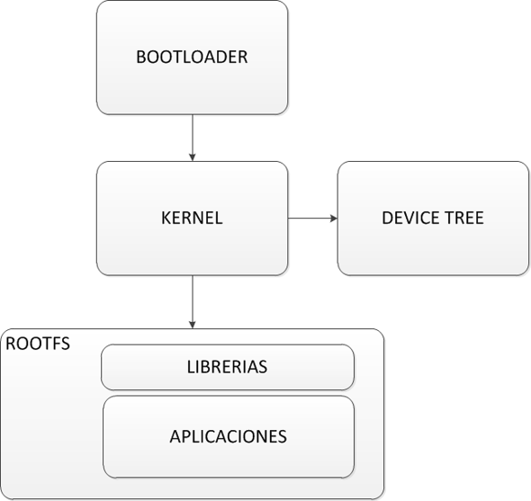

# Tema 1: Introducción a Linux Embebido



## 1. ¿Qué es un sistema embebido? Definición y características

Un sistema embebido es un **sistema de computación** especializado diseñado para realizar una función específica dentro de un dispositivo más grande. A diferencia de un ordenador de propósito general, los sistemas embebidos están optimizados para tareas concretas y suelen funcionar en entornos con restricciones de recursos. Estos sistemas pueden encontrarse en una amplia gama de dispositivos, desde electrodomésticos hasta sistemas industriales y automóviles.

Las principales características de un sistema embebido incluyen:

- **Dedicación a una tarea específica**: Los sistemas embebidos están diseñados para realizar una función concreta, como gestionar un panel de control en un vehículo o procesar datos de un sensor en una fábrica.
- **Limitaciones de recursos**: A menudo, estos sistemas cuentan con procesadores de baja potencia, memoria limitada y almacenamiento restringido, lo que implica la necesidad de optimizar el software para funcionar en estas condiciones.
- **Alta fiabilidad y estabilidad**: Dado que muchos sistemas embebidos operan en entornos críticos, es esencial que sean altamente confiables y capaces de funcionar durante largos períodos sin fallos.
- **Integración con hardware especializado**: Muchos sistemas embebidos incluyen interfaces para sensores, actuadores, y otras formas de hardware personalizado.
- **Frecuentemente operan en tiempo real**: En aplicaciones donde el tiempo de respuesta es crítico, como en sistemas de control industrial, los sistemas embebidos pueden requerir características de tiempo real.

## 2. Diferencias entre Linux embebido y Linux de escritorio

Linux embebido y Linux de escritorio comparten el mismo núcleo (kernel), pero están diseñados para contextos y propósitos diferentes. Mientras que un sistema Linux de escritorio está optimizado para la ejecución de múltiples aplicaciones interactivas con una interfaz gráfica, un sistema Linux embebido está diseñado para ser eficiente y cumplir con requerimientos específicos.

Algunas diferencias clave son:

- **Recursos de hardware**: Linux embebido se ejecuta en dispositivos con recursos limitados, como microcontroladores o SoCs (System-on-Chip), mientras que Linux de escritorio puede aprovechar procesadores potentes y grandes cantidades de memoria.
- **Flexibilidad**: Linux de escritorio es un sistema generalista, capaz de ejecutar múltiples tipos de software, mientras que Linux embebido se configura para un conjunto reducido de aplicaciones.
- **Interfaz gráfica**: Mientras que Linux de escritorio casi siempre incluye un entorno gráfico como GNOME o KDE, en sistemas embebidos, la presencia de una interfaz gráfica no es obligatoria y en muchos casos se emplean interfaces minimalistas o incluso solo una terminal.
- **Mantenimiento y actualizaciones**: Los sistemas embebidos suelen ser más estáticos y pueden no actualizarse con la misma frecuencia que un sistema de escritorio. Su actualización es un proceso más crítico puesto que puede bloquear el dispositivo.

| Característica        | Linux de Escritorio              | Linux Embebido                     |
|------------------------|----------------------------------|------------------------------------|
| Propósito              | Uso general, multitarea          | Funciones específicas             |
| Hardware               | Potente, sin restricciones       | Limitado, recursos críticos       |
| Tamaño del sistema     | Grande, muchas dependencias      | Ligero, altamente optimizado       |
| Interfaces de usuario  | Gráficas (GUI)                   | Frecuentemente sin GUI o minimal   |
| Tiempo de arranque     | Lento                            | Rápido                            |
| Actualizaciones        | Regulares, por el usuario        | Controladas por el fabricante      |


## 3. Comparativa de Linux embebido con otros sistemas (RTOS, Bare-metal)

Para entender mejor las ventajas e inconvenientes de Linux embebido, es útil compararlo con otras alternativas comunes como los sistemas operativos en tiempo real (RTOS) y los sistemas bare-metal.

- **Linux embebido**: Ofrece multitarea, gestión de memoria y una rica colección de controladores y software. Sin embargo, puede no ser lo suficientemente **determinista** para aplicaciones de tiempo real estrictas.
- **RTOS (Real-Time Operating System)**: Diseñados para garantizar tiempos de respuesta predecibles, los RTOS son ideales para aplicaciones que requieren ejecución en plazos estrictos, como sistemas de control en automoción o robótica.
- **Bare-metal**: No utiliza un sistema operativo, sino que ejecuta código directamente en el hardware. Esto proporciona el máximo control y velocidad, pero aumenta la complejidad del desarrollo y mantenimiento.

## 4. Historia y evolución de Linux embebido

```
From: Linus Benedict Torvalds (torvalds@klaava.Helsinki.FI)
Newsgroups: comp.os.minix
Subject: What would you like to see most in minix?
Summary: small poll for my new operating system
Message-ID: <1991Aug25.205708.9541@klaava.Helsinki.FI>
Date: 25 Aug 91 20:57:08 GMT
Organization: University of Helsinki

Hello everybody out there using minix -

I'm doing a (free) operating system (just a hobby, won't be big and
professional like gnu) for 386(486) AT clones. This has been brewing
since april, and is starting to get ready. I'd like any feedback on
things people like/dislike in minix, as my OS resembles it somewhat
(same physical layout of the file-system (due to practical reasons)
among other things).

I've currently ported bash(1.08) and gcc(1.40), and things seem to work.
This implies that I'll get something practical within a few months, and
I'd like to know what features most people would want. Any suggestions
are welcome, but I won't promise I'll implement them :-)

Linus (torvalds@kruuna.helsinki.fi)

PS. Yes - it's free of any minix code, and it has a multi-threaded fs.
It is NOT portable (uses 386 task switching etc), and it probably never
will support anything other than AT-harddisks, as that's all I have :-(.
```

El uso de Linux en sistemas embebidos ha evolucionado significativamente desde sus inicios. En los años 90, los desarrolladores comenzaron a adaptar el kernel de Linux gracias a su licencia GNU y a su espiritu basado en la colaboración. De esta forma, el kernel de Linux ha pasado de ser un proyecto personal que "problemente nunca soportará nada que no sea discos duros AT" a ser un kernel portado a decenas de arquitecturas y con soporte para centenas de periféricos.

### Evolución de Linux Embebido

| Año  | Hito                                      | Descripción |
|------|-------------------------------------------|-------------|
| **1991** | Lanzamiento de Linux 0.1 | Linus Torvalds publica la primera versión del núcleo de Linux como un sistema operativo de código abierto para PCs IBM. |
| **1995** | Inclusión de soporte para múltiples arquitecturas | Linux versión 1.2 añade soporte para Alpha, i386, MIPS y SPARC, facilitando su portabilidad a dispositivos embebidos. |
| **1996** | Inclusión de arquitecturas m68k y PowerPC | Linux 2.0 amplía el soporte a las arquitecturas m68k y PowerPC, comunes en dispositivos embebidos. |
| **1996** | Inicio del proyecto BusyBox | Bruce Perens inicia BusyBox, creando una suite de utilidades Unix ligeras, ideales para sistemas embebidos debido a su reducido tamaño. |
| **1997** | Proyecto Linux Router (LRP) | Dave Cinege lanza LRP, utilizando BusyBox para crear un Linux arrancable desde disquete que convierte una PC en un router, uno de los primeros proyectos reales de Linux embebido. |
| **1998** | Desarrollo de uClinux | Kenneth Albanowski y D. Jeff Dionne trabajan en uClinux, una versión de Linux para sistemas sin unidad de gestión de memoria (MMU), ampliando el rango de hardware capaz de ejecutar Linux. |
| **1999** | Lanzamiento de ELKS | Se presenta el Subconjunto de Kernel de Linux Integrable (ELKS), diseñado para ordenadores de 16 bits con recursos de memoria limitados, como los sistemas basados en Intel 8086. |
| **2001** | Creación de Buildroot | Nace Buildroot como un framework para automatizar la generación de sistemas Linux embebidos minimizados, facilitando la compilación cruzada y la integración de software. |
| **2003** | Fundación del Consorcio de Linux Embebido (ELC) | Empresas como IBM, Intel, Motorola y Samsung forman el ELC para estandarizar y promover el uso de Linux en sistemas embebidos. |
| **2004** | Asociación de Wind River con Red Hat | Wind River, desarrollador de VxWorks, se asocia con Red Hat para presentar Wind River Linux, entrando en el mercado de dispositivos embebidos con Linux. |
| **2010** | Fundación de Linaro | ARM, Freescale, IBM, Samsung, ST-Ericsson y Texas Instruments anuncian Linaro, enfocada en mejorar el desarrollo de software de código abierto para SoCs avanzados. |
| **2011** | Lanzamiento del Proyecto Yocto | La Fundación Linux lanza el Proyecto Yocto para facilitar la creación de distribuciones de Linux para software embebido e IoT, independientes de la arquitectura de hardware. |


A medida que el hardware se ha vuelto más potente y asequible, Linux embebido ha encontrado aplicaciones en industrias como la automoción, la domótica y la robótica.

## 5. Casos de uso en la industria

### Automoción
- **Unidad de Control Electrónico (ECU)**: Controla la inyección de combustible y la ignición del motor.
- **Sistema de frenos ABS**: Regula la presión de frenado para evitar bloqueos.
- **Sistemas de infoentretenimiento**: Pantallas táctiles con navegación GPS y conectividad.
- **Sensores de aparcamiento y cámaras**: Asistencia en la conducción.

### Dispositivos Médicos
- **Marcapasos**: Dispositivos implantados que regulan el ritmo cardíaco.
- **Bombas de insulina**: Dispensan insulina automáticamente según los niveles de glucosa.
- **Monitores de signos vitales**: Miden parámetros como presión arterial y frecuencia cardíaca.

### Electrónica de Consumo
- **Smart TVs**: Gestionan la reproducción de contenido y la conectividad.
- **Asistentes virtuales (Alexa, Google Home)**: Responden a comandos de voz y gestionan dispositivos.
- **Cámaras digitales**: Controlan el enfoque, la exposición y el procesamiento de imágenes.

### Industria y Automatización
- **Controladores lógicos programables (PLC)**: Gestionan procesos industriales automatizados.
- **Robots industriales**: Ejecutan tareas repetitivas con precisión en líneas de ensamblaje.
- **Sensores de monitoreo en fábricas**: Detectan temperatura, presión y calidad del aire.

### Aeroespacial y Defensa
- **Sistemas de control de vuelo**: Regulan la navegación y estabilidad de aeronaves.
- **Drones**: Utilizan sensores embebidos para navegación autónoma.
- **Sistemas de radar y sonar**: Detectan objetos y analizan el entorno.

### Telecomunicaciones
- **Routers y módems**: Gestionan la conectividad y transmisión de datos.
- **Torres de comunicación 5G**: Optimizan la distribución de señales.
- **Sistemas de cifrado en redes**: Protegen la transmisión de datos.

### Domótica y Hogares Inteligentes
- **Termostatos inteligentes (Nest, Ecobee)**: Regulan la temperatura del hogar.
- **Sistemas de seguridad (cámaras y alarmas)**: Monitorean y protegen el hogar.
- **Electrodomésticos inteligentes**: Lavadoras, refrigeradores y hornos con conectividad.

## 6. Componentes de un sistema embebido

1. **Bootloader**: Primer software que se ejecuta, inicializa el hardware y carga el kernel.  
   _Ejemplos_: U-Boot, Barebox
2. **Kernel de Linux**: Encargado de la gestión de procesos, memoria, dispositivos.  
   _Puede ser vanilla o modificado por el fabricante._
3. **Root Filesystem (RootFS)**: Sistema de archivos con librerías y utilidades.  
   _Ejemplos_: BusyBox, systemd, init
4. **Aplicaciones**: Software específico del dispositivo.  
   _Ejemplos_: interfaz web, controladores personalizados

## 7. Requisitos de hardware típicos para Linux embebido

- **CPU**: 32 o 64 bits, ARM, RISC-V, MIPS
- **RAM**: Desde 16MB hasta GBs dependiendo del caso
- **Almacenamiento**: NAND, NOR, eMMC, microSD
- **Periféricos**: UART, SPI, I2C, Ethernet, USB, GPIO
- **Debug**: UART serie, JTAG

## 8. Ejemplos de hardware popular

- **BeagleBone Black**: AM335x ARM Cortex-A8, muy usada en educación e industria
- **Raspberry Pi**: Popular, potente, no siempre ideal para aplicaciones industriales ni fines educativos.
- **STM32MP1**: Dual Cortex-A7 + Cortex-M4, soporte de ST y comunidad
- **NXP i.MX8**: Alta gama, gráficos, virtualización, automoción e IoT

## 9. Desafíos en el desarrollo de Linux embebido

- **Compatibilidad de hardware**: No todo el hardware tiene soporte oficial en el kernel principal de Linux. Es común tener que adaptar o desarrollar drivers, integrar soporte mediante device trees y validar periféricos específicos del hardware objetivo. Esto requiere entender la arquitectura de Linux y del SoC utilizado.
- **Tiempo de arranque**: Muchos sistemas embebidos deben arrancar rápidamente. Para ello, se optimizan las fases de bootloader (U-Boot, Barebox), el kernel (quitando drivers y funcionalidades innecesarias) y el espacio de usuario (usando BusyBox, minimizando servicios, aplicando técnicas como systemd-analyze o bootchart).
- **Tamaño del sistema**: En sistemas con recursos limitados, se debe minimizar el uso de almacenamiento y memoria. Esto implica crear RootFS mínimos, eliminar bibliotecas o binarios innecesarios, usar BusyBox o ToyBox, y compilar con opciones de stripping y optimización (-Os, LTO).
- **Licenciamiento**: Linux y sus componentes están sujetos a licencias como GPL y LGPL. Es obligatorio liberar las modificaciones al kernel o drivers GPL, mantener avisos de copyright y ofrecer el código fuente al usuario si se distribuye el firmware. No cumplir puede acarrear problemas legales.
- **Seguridad**: Muchos dispositivos embebidos son susceptibles a ataques. Es necesario implementar arranque seguro (secure boot), particiones de solo lectura, mecanismos de actualización seguras (A/B, OTA), cifrado de datos, control de acceso y actualizaciones regulares del sistema.
- **Depuración**: En entornos embebidos puede ser difícil acceder al sistema para depurar. Se usan herramientas como JTAG, GDB remoto, strace, perf, dmesg, y técnicas como logs en RAM, LEDs para trazas, o buffers circulares. Además, se depende mucho de la simulación con QEMU en las fases iniciales.


## 10. Herramientas y flujos de trabajo comunes

Un sistema Linux embebido siempre requiere los siguientes componentes:
- **Bootloader**: Es el software encargado de iniciar el sistema y cargar el kernel de Linux.
- **Kernel de Linux**: El núcleo del sistema operativo que gestiona el hardware y los procesos.
- **RootFS (Sistema de archivos raíz)**: Contiene las bibliotecas y aplicaciones necesarias para que el sistema funcione.

Para generar estos componentes, existen varios enfoques:

| Método | Características | Ventajas | Inconvenientes |
|--------|---------------|----------|---------------|
| **Manual (Cross Linux From Scratch - CLFS)** | Construcción manual de cada componente del sistema. | Control total sobre el sistema, optimización extrema. | Proceso laborioso y requiere experiencia avanzada. |
| **BusyBox** | Proporciona un sistema minimalista con herramientas básicas de Unix. | Ligero y rápido, ideal para sistemas con recursos limitados. | No incluye herramientas avanzadas o personalización extensa. |
| **Buildroot** | Framework que permite generar un sistema embebido con un conjunto de paquetes predefinidos. | Fácil de usar, rápido de configurar, buena documentación. | Menos flexible que Yocto, menos escalable. |
| **Yocto Project** | Plataforma modular y flexible para crear distribuciones Linux embebidas personalizadas. | Altamente configurable, soporte para múltiples arquitecturas, escalabilidad. | Curva de aprendizaje pronunciada, requiere más recursos de compilación. |


Nota: [Cross Linux From Scratch](https://trac.clfs.org/)

Cada una de estas opciones ofrece diferentes grados de flexibilidad, complejidad y optimización, por lo que la elección depende de los requisitos del sistema embebido que se esté desarrollando.
