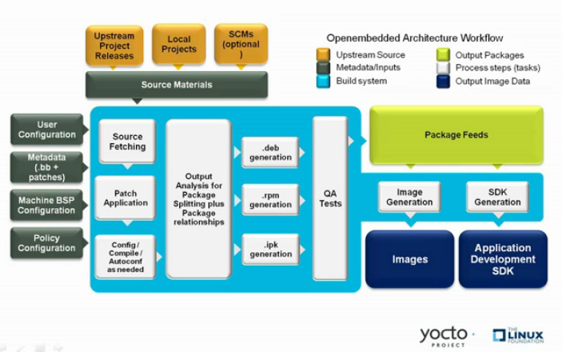

# Tema 8: Proyecto Yocto

## Introducción al Proyecto Yocto y su Importancia en Embebidos

El **Proyecto Yocto** es una iniciativa liderada por la **Linux Foundation** que proporciona un conjunto de herramientas para crear distribuciones Linux personalizadas, especialmente para dispositivos embebidos. A diferencia de una distribución predefinida como Ubuntu o Debian, Yocto permite construir desde cero un sistema ajustado exactamente al hardware y las necesidades del proyecto.

Su arquitectura modular, basada en capas y recetas, permite definir qué software se compila, qué configuración se aplica y cómo se organiza el sistema final.

---

## Beneficios Clave

- **Personalización total** del sistema operativo.
- **Compatibilidad con múltiples arquitecturas** (ARM, x86, MIPS...)
- **Mantenibilidad y escalabilidad** a largo plazo.
- **Reproducibilidad** del build gracias a su sistema de recipes y capas.
- Uso de **capas** (`layers`) para aislar configuraciones, recetas y BSPs.
- Ampliamente adoptado por la industria y respaldado por la comunidad **OpenEmbedded**.

---

## Ecosistema de Yocto: Componentes principales

El Proyecto Yocto no es una herramienta única, sino un conjunto de herramientas y repositorios integrados que permiten construir el sistema completo:

### Diagrama de componentes principales:



### Descripción de componentes:

#### ✅ Poky
Es la referencia oficial de distribución Yocto. Incluye BitBake, recetas básicas, configuraciones y capas base (como `meta`, `meta-poky`, `meta-yocto-bsp`).

#### ✅ BitBake
Motor de construcción similar a `make`, pero basado en recetas. Lee archivos `.bb` y `.bbappend` para definir cómo construir paquetes.

#### ✅ OpenEmbedded
Es la comunidad que mantiene muchas de las recetas que Yocto usa. El layer `meta-openembedded` contiene miles de paquetes adicionales y es mantenido por la comunidad.

#### ✅ Capas (layers)
Permiten modularizar el sistema. Una capa puede contener:
- Recetas (`recipes-*/*.bb`)
- Configuraciones (`conf/layer.conf`)
- Archivos de soporte para plataformas (BSPs)

#### ✅ BSP (Board Support Package)
Conjunto de configuraciones, parches y recetas específicas para una plataforma de hardware (ej: `meta-beaglebone`, `meta-raspberrypi`).

---

## Ejemplo de estructura típica en un proyecto Yocto

```plaintext
meta-miempresa/        # Tu capa personalizada
meta-openembedded/     # Paquetes adicionales
poky/
├── bitbake/               # Motor de construcción
├── meta/                  # Capas base del sistema
├── meta-poky/             # Configuración de referencia
├── meta-yocto-bsp/        # BSPs de referencia
└── build/                 # Carpeta generada con bitbake
```
## Recursos adicionales

- [https://www.yoctoproject.org](https://www.yoctoproject.org)


## Instalación y Configuración del Entorno de Yocto

### Requisitos del sistema:
- Ubuntu/Debian 64-bit (preferido) o Fedora.
- Instalación de paquetes necesarios:
  ```bash
  sudo apt update && sudo apt install -y gawk wget git-core diffstat unzip texinfo gcc-multilib build-essential chrpath socat cpio python3 python3-pip python3-pexpect xz-utils debianutils iputils-ping
  ```

### Clonación del Proyecto Yocto:
```bash
git clone git://git.yoctoproject.org/poky.git -b Scarthgap
cd poky
```

### Configuración del Entorno:
```bash
source oe-init-build-env
```
Esto crea un directorio `build` donde se configurará la construcción.

---

## Componentes Principales: Poky, BitBake, Meta-Layers

### **Poky**
Poky es la referencia de implementación en Yocto y contiene:
- **BitBake**: Motor de construcción.
- **Meta-poky**: Capa de referencia con configuraciones base.
- **Meta-openembedded**: Capas adicionales con paquetes complementarios.

### **BitBake**
BitBake es la herramienta encargada de ejecutar las recetas de construcción.

Ejemplo de construcción:
```bash
bitbake core-image-minimal
```

### **Meta-Layers**
Las capas (**meta-layers**) permiten modularizar el sistema. Ejemplo:
- `meta-yocto-bsp`: Contiene BSPs de referencia.
- `meta-openembedded`: Repositorio de paquetes adicionales.

---

## Creación de Imágenes con Yocto

Para generar una imagen básica:
```bash
bitbake core-image-minimal
```
Esto generará una imagen lista para flashear en el hardware.

Para agregar paquetes, edita `conf/local.conf`:
```bash
IMAGE_INSTALL_append = " vim git "
```

---

## Configuración y Personalización de Recetas

Las recetas (`.bb`) definen cómo se construyen los paquetes.
Ejemplo de receta:
```bitbake
SUMMARY = "Mi aplicación personalizada"
LICENSE = "MIT"
SRC_URI = "git://github.com/usuario/miapp.git"
S = "${WORKDIR}/git"
inherit autotools
```

Ejemplo de creación de una capa personalizada:
```bash
bitbake-layers create-layer meta-miapp
```


Las recetas, pueden usarse para incluir en el rootfs:
- Aplicaciones
- Ficheros de configuración
- Añadir permisos o usuarios al rootfs

### Ejemplo 1: Receta dedicada para añadir un fichero de configuración

#### Estructura de archivos:
```
meta-custom/recipes-config/my-config/my-config.bb
meta-custom/recipes-config/my-config/
├── my_config.conf/ # Fichero de configuración
```

##### Contenido del fichero de configuración (my_config.conf):
```
# CONFIG_VAR=1
# DEBUG=true
```

###### my-config.bb
```
DESCRIPTION = "Configuración personalizada para el sistema"
LICENSE = "CLOSED"
SRC_URI += "file://my_config.conf"

S = "${WORKDIR}"

do_install() {
    install -d ${D}${sysconfdir}/myapp
    install -m 0644 ${WORKDIR}/my_config.conf ${D}${sysconfdir}/myapp/my_config.conf
}

FILES:${PN} += "${sysconfdir}/myapp/my_config.conf"
```

### Ejemplo 2: Modificar receta de componente SW para incluir configuración

```
meta-custom/recipes-opencv/opencv-app/opencv-app.bb
meta-custom/recipes-opencv/opencv-app/files
├── my_app.conf # Fichero de configuración
```

#### Contenido del fichero de configuración (my_app.conf):
```
# ---
# [settings]
# camera_id=0
# resolution=640x480
# ---
```

#### opencv-app.bb
```
DESCRIPTION = "Aplicación que usa OpenCV"
LICENSE = "MIT"
SRC_URI = "git://git.example.com/opencv_app.git;branch=main \
           file://my_app.conf"

S = "${WORKDIR}/git"

inherit cmake

do_install:append() {
    install -d ${D}${sysconfdir}/opencv
    install -m 0644 ${WORKDIR}/my_app.conf ${D}${sysconfdir}/opencv/my_app.conf
}

FILES:${PN} += "${sysconfdir}/opencv/my_app.conf"
```

### Ejemplo 3: Añadir un usuario y asignarle password, grupos y permisos.

```
# user1.bb
SUMMARY = "Añade el usuario 'user1' al sistema con contraseña y grupo"
DESCRIPTION = "Crea el usuario 'user1', le asigna la contraseña 'temp_password' y lo añade al grupo 'users'"
LICENSE = "MIT"

inherit useradd

# Define el usuario y grupo
USERADD_PACKAGES = "${PN}"
USERADD_PARAM:${PN} = "-u 1001 -G users -p '\$6\$abcd\$9P31ZCIEYlMhzLRAx5Kv2rUPiZ0OWs7tG63PCvvbMuGQbxR2p5Z4DLb7IYPq95uwOjMQTxJIEQesfCZ2vUzR1/' user1"

# NOTA: La contraseña anterior es 'temp_password' en formato SHA-512 (se genera con `mkpasswd -m sha-512` o `openssl passwd -6`)

# Este paquete no instala archivos, solo crea el usuario en el sistema
do_install[noexec] = "1"
```

Para generar la contraseña en formato SHA-512:
```
mkpasswd -m sha-512 temp_password
# o alternativamente:
openssl passwd -6 temp_password
```


---

## Gestión de Paquetes en Yocto (`opkg`, `rpm`, `dpkg`)


### 1. Tipos de sistemas de paquetes soportados

#### 🧩 `opkg`
- Ligero y optimizado para sistemas embebidos.
- Usado por defecto en configuraciones como `core-image-minimal`.
- Soporta repositorios locales y remotos.

#### 📦 `rpm`
- Usado en distribuciones como Red Hat, Fedora, CentOS.
- Ofrece una potente gestión de dependencias y firmas.
- Adecuado para sistemas embebidos más complejos.

#### 📦 `dpkg`
- Sistema de paquetes base de Debian/Ubuntu.
- Compatible con herramientas como `apt`, `dpkg`, `apt-get` (cuando se configura).

---

### 2. Seleccionar el tipo de paquetes en Yocto

El tipo de sistema de paquetes se define en `local.conf`:

```bash
PACKAGE_CLASSES ?= "package_ipk"
```

Opciones posibles:
- `package_ipk`
- `package_rpm`
- `package_deb`

Puedes combinar varios tipos si lo deseas:

```bash
PACKAGE_CLASSES ?= "package_ipk package_deb"
```

> Nota: Cambiar el tipo de paquete requiere limpiar el build anterior (`bitbake -c cleansstate <imagen>`).

---

### 3. Generar paquetes manualmente

Para generar un paquete `.ipk`, `.rpm` o `.deb` de una receta:

```bash
bitbake <nombre-paquete> -c package_write_ipk
```

O para `.rpm`:
```bash
bitbake <nombre-paquete> -c package_write_rpm
```

O para `.deb`:
```bash
bitbake <nombre-paquete> -c package_write_deb
```

Los paquetes generados se encuentran en:

```bash
tmp/deploy/ipk/
tmp/deploy/rpm/
tmp/deploy/deb/
```

---

### 4. Usar `opkg` en el sistema objetivo

Si tu imagen tiene `opkg`, puedes instalar paquetes directamente desde la terminal del sistema embebido:

```bash
opkg update
opkg install hello
```

Puedes crear tu propio feed local y configurar `/etc/opkg/*.conf` para apuntar a él.

---

### 5. Incluir un sistema de paquetes en tu imagen

Edita tu receta de imagen personalizada:

```bitbake
IMAGE_FEATURES += "package-management"
```

Esto incluirá herramientas como `opkg` en el rootfs para poder instalar paquetes en tiempo de ejecución.


## Construcción de un RootFS con Yocto

El **RootFS** es el sistema de archivos base del sistema embebido.

Para generar un `tar.gz` del rootfs:
```bash
bitbake core-image-minimal -c rootfs_tarball
```
Para inspeccionar el contenido:
```bash
tar -tvf tmp/deploy/images/qemux86/core-image-minimal-qemux86.tar.gz
```

---

## Integración de Kernel y U-Boot en Yocto

Para compilar U-Boot:
```bash
bitbake u-boot
```
Para compilar un kernel personalizado:
```bash
bitbake virtual/kernel
```

---

## Creación de un BSP en Yocto

Un **Board Support Package (BSP)** incluye:
- Soporte para el kernel.
- Drivers necesarios.
- Configuraciones personalizadas.

Estructura de un BSP:
```
meta-mi-bsp/
├── conf/
│   ├── layer.conf
├── recipes-bsp/
│   ├── u-boot/
│   ├── linux/
```

Para agregar un BSP personalizado:
```bash
bitbake-layers add-layer meta-mi-bsp
```

---

## Debugging y Optimización de Yocto

Herramientas de debugging:
- `bitbake -e`: Ver variables de entorno.
- `bitbake -c devshell <paquete>`: Entrar en shell de desarrollo.
- `bitbake -c cleansstate <paquete>`: Limpiar y reconstruir.

Para optimizar el tiempo de construcción:
- Habilitar compilación paralela:
  ```bash
  BB_NUMBER_THREADS = "8"
  PARALLEL_MAKE = "-j8"
  ```
- Usar `sstate-cache` para reducir tiempos de recompilación.

---

## ¿Cómo detectar qué necesitamos y reducir el tamaño necesario?

Optimizar el tamaño de la imagen generada en Yocto es fundamental en sistemas embebidos con recursos limitados. A continuación se explican diferentes estrategias para reducir el tamaño del sistema.

---

### 1. Eliminar paquetes innecesarios

Muchos paquetes se incluyen por defecto debido a `IMAGE_FEATURES`. Para evitarlo:

```bitbake
IMAGE_FEATURES:remove = "package-management"
```

Esto eliminará gestores de paquetes como `opkg`, `apt`, `dpkg` del rootfs, que no son necesarios en sistemas que no realizarán instalaciones en runtime.

Adicionalmente puedes controlar los paquetes directamente:

```bitbake
IMAGE_INSTALL:remove = "nano htop gdb"
```

---

### 2. Reducir el núcleo a lo esencial

Si usas `linux-yocto`, puedes personalizar el kernel con:

```bash
bitbake linux-yocto -c menuconfig
```

Esto abre una interfaz de configuración donde puedes deshabilitar:
- Drivers innecesarios
- Sistemas de archivos no usados
- Funcionalidades de red o seguridad no requeridas

Luego guarda y exporta tu configuración con:
```bash
bitbake linux-yocto -c savedefconfig
```

Y asegúrela usando un fragmento en tu BSP (`defconfig` o `cfg`).

---

### 3. Usar BusyBox en lugar de GNU Coreutils

BusyBox combina muchas herramientas UNIX en un solo binario y es mucho más pequeño que las versiones completas de `coreutils`, `util-linux`, etc.

Para usar BusyBox (ya suele venir por defecto en `core-image-minimal`), asegúrate de que `coreutils` no esté en tu imagen:

```bitbake
IMAGE_INSTALL:remove = "coreutils"
```

Y si es necesario personaliza BusyBox con:

```bash
bitbake busybox -c menuconfig
```

---

### 4. Eliminar símbolos de depuración

Asegúrate de **no incluir** información de debugging si no la necesitas:

```bitbake
INHERIT:remove = "rm_work"
INHERIT:remove = "buildstats"
DEBUG_BUILD = "0"
```

Adicionalmente, puedes usar:

```bitbake
INHERIT += "rm_work"
```

Esto eliminará los archivos temporales tras compilar, reduciendo el espacio en disco usado en el host (no el rootfs).

Para eliminar los paquetes `-dbg`:

```bitbake
PACKAGE_DEBUG_SPLIT_STYLE = "debug-file-directory"
INHIBIT_PACKAGE_DEBUG_SPLIT = "1"
```

---

### 5. Detectar las recetas que se compilan para una imagen

Para saber qué recetas están siendo incluidas en una imagen (y potencialmente eliminarlas):

Ejecuta:

```bash
bitbake <nombre-imagen> -g
```

Esto generará archivos de dependencia en tu directorio actual:

- `pn-buildlist` → lista exacta de recetas que se van a construir
- `task-depends.dot` y `package-depends.dot` → gráficas de dependencias (puedes visualizarlas con Graphviz)

Puedes abrir `pn-buildlist` y revisar todas las recetas para decidir cuáles puedes eliminar o reemplazar con opciones más ligeras.


#### Eliminar del build las recetas no usadas

Tras auditar nuestra imagen y eliminar recetas que no queremos incluir en nuestra imagen, podemos tener la situación de que haya recetas compiladas (junto con su código descargado) que ya no estamos incluyendo en nuestra imagen. Para reducir el espacio utilizado en nuestra máquina de build, podemos limpiar de la cache esos paquetes.

Para ello, no hay un comando concreto de bitbake, si no que tenemos que:

- Obtener un listado de recetas que están actualmente construidas
- Obtener un listado de recetas que se incluyen en nuestra imagen
- Eliminar todas las recetas que están compiladas pero ya no forman parte de nuestra imagen.


