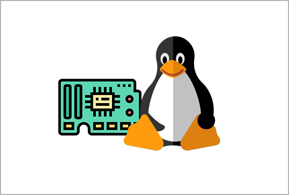

# Tema 2: Entorno de Desarrollo en Linux Embebido

## Arquitecturas de CPU en sistemas embebidos
En los sistemas embebidos, se utilizan diversas arquitecturas de CPU según las necesidades del dispositivo.

### Arquitecturas más comunes:
- **ARM**: La más usada en sistemas embebidos debido a su eficiencia energética y rendimiento.
- **RISC-V**: Arquitectura abierta y modular, emergente en el mundo embebido.
- **MIPS**: Utilizada en enrutadores y sistemas industriales.
- **x86**: Menos común en embebidos, pero presente en plataformas industriales y SBCs avanzados.

### Diferencias entre arquitecturas de 32 y 64 bits
| Característica | 32 bits | 64 bits |
|--------------|---------|---------|
| Espacio de direcciones | 4GB máximo | Teóricamente ilimitado |
| Uso de memoria | Menos eficiente en grandes volúmenes de RAM | Mejor gestión de memoria |
| Instrucciones | Menos complejas | Mayor capacidad de cómputo |

[Instruction set ARM64](https://developer.arm.com/documentation/ddi0602/2024-12/?lang=en)



## Memoria en sistemas embebidos
Los sistemas embebidos emplean diferentes tipos de memoria, cada una con características específicas:

- **RAM (Random Access Memory)**: Memoria volátil usada para ejecutar programas.
- **ROM (Read-Only Memory)**: Memoria no volátil con firmware o bootloaders.
- **SRAM (Static RAM)**: Más rápida y cara que DRAM, usada en cachés.
- **DRAM (Dynamic RAM)**: Memoria principal en sistemas embebidos, necesita refresco constante.

## Almacenamiento en Linux Embebido
Los sistemas embebidos pueden usar distintos medios de almacenamiento:

- **Tarjetas SD**: Baratas y fáciles de usar, pero con menor durabilidad.
- **eMMC**: Memoria flash integrada, más confiable que SD.
- **NAND Flash**: Alta capacidad y rendimiento, usada en almacenamiento interno.
- **SPI Flash**: Memoria flash de baja capacidad conectada por SPI.

## Interfaces de hardware en sistemas embebidos
Los sistemas embebidos se comunican con sensores y periféricos mediante diversas interfaces:

- **GPIO (General Purpose Input/Output)**: Puntos de E/S programables.
- **I2C (Inter-Integrated Circuit)**: Bus de comunicación de dos hilos para sensores y dispositivos de baja velocidad.
- **SPI (Serial Peripheral Interface)**: Protocolo rápido para conectar memorias y periféricos.
- **UART (Universal Asynchronous Receiver-Transmitter)**: Comunicación serie, usada para depuración.
- **CAN (Controller Area Network)**: Comunicación en tiempo real para automoción e industria.
- **PCIe (Peripheral Component Interconnect Express)**: Conexión de alta velocidad para hardware avanzado.
- **USB (Universal Serial Bus)**: Uso en almacenamiento, periféricos y comunicación.

## Entrada y salida en sistemas embebidos
Los sistemas embebidos manejan diversos dispositivos de entrada/salida:

- **Sensores**: Captan información del entorno (temperatura, aceleración, etc.).
- **Pantallas**: LCD, OLED o ePaper para visualización.
- **Teclados y botones**: Entrada de usuario en sistemas interactivos.
- **Actuadores**: Motores, servos, relés para control físico.

## Tipos de buses y protocolos en Linux embebido
Linux embebido soporta múltiples buses de comunicación:

| Bus | Características |
|-----|---------------|
| **I2C** | Bajo consumo, hasta 400 kHz, soporta múltiples dispositivos. |
| **SPI** | Comunicación rápida, full-duplex, común en memorias y pantallas. |
| **UART** | Serial, asíncrono, usado para depuración y comunicación con periféricos. |
| **CAN** | Usado en automoción e industria, resistente a ruido. |
| **PCIe** | Alta velocidad, usado en hardware avanzado. |
| **USB** | Versátil, usado para almacenamiento y conectividad. |

## Comunicación con hardware desde Linux
Linux embebido permite interactuar con hardware mediante:

- **Archivos de dispositivo (`/dev`)**: Representan periféricos como archivos.
- **`sysfs`**: Exposición de información del hardware en `/sys`.
- **`mmap`**: Acceso directo a memoria de hardware.

Ejemplo de control de un GPIO en Linux:
```bash
echo 17 > /sys/class/gpio/export
echo out > /sys/class/gpio/gpio17/direction
echo 1 > /sys/class/gpio/gpio17/value  # Enciende el GPIO
echo 0 > /sys/class/gpio/gpio17/value  # Apaga el GPIO
```

## Herramientas de monitoreo de hardware en Linux embebido
Algunas herramientas esenciales para diagnosticar y monitorear hardware:

- **`i2cdetect`**: Escaneo de dispositivos I2C.
- **`spidev_test`**: Prueba de comunicación SPI.
- **`gpioinfo`**: Información de pines GPIO.
- **`dmesg`**: Registro de eventos del kernel.

## Flujos de trabajo recomendados para desarrollo en Linux embebido
1. **Configuración del entorno**: Preparar una máquina de desarrollo con cross-toolchain.
2. **Compilación cruzada**: Usar compiladores como `arm-linux-gnueabihf-gcc`.
3. **Flasheo de imágenes**: Grabar firmware en almacenamiento con `dd` o `Balena Etcher`.
4. **Pruebas y depuración**: Uso de `GDB`, `strace`, `dmesg` para diagnóstico.
5. **Automatización**: Scripting con Bash o Python para simplificar tareas.

---
**Fin del Tema 2**
